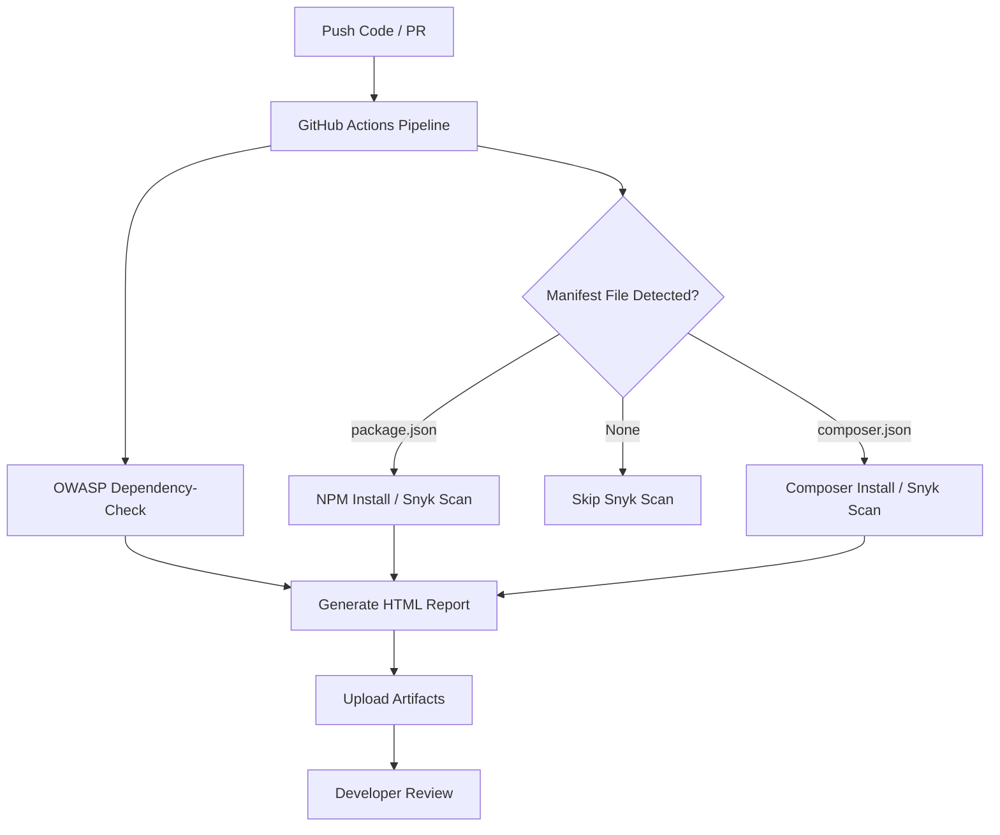

# DevSecOps Week 7

## Software Composition Analysis (SCA) Pipeline

Proyek: Web Antrian – DevSecOps Implementation

[](https://github.com/kimookoii/devsecops-week6/actions/workflows/ci-sca-multi.yml)
[]()
[]()
[]()
[]()

---

## 1. Deskripsi Proyek

Repository ini menerapkan Software Composition Analysis (SCA) pada aplikasi Web Antrian menggunakan tiga pendekatan utama:

1. OWASP Dependency-Check
2. Snyk CLI
3. GitHub Dependabot

Integrasi dilakukan melalui GitHub Actions agar setiap perubahan kode otomatis dipindai untuk mendeteksi kerentanan pada library open-source yang digunakan.

---

## 2. Struktur CI/CD Pipeline SCA

Diagram berikut menunjukkan alur SCA otomatis menggunakan GitHub Actions.



---

## 3. Software Composition Analysis

### 3.1 Pengertian SCA

Software Composition Analysis (SCA) adalah proses untuk mengidentifikasi dependency open-source yang digunakan dalam aplikasi, menganalisis:

* Versi library
* Kerentanan (CVE)
* Severity level
* Rekomendasi versi fix
* Dampak terhadap keamanan aplikasi

70% lebih kode aplikasi modern bergantung pada library pihak ketiga, sehingga SCA penting dalam pengembangan aplikasi modern.

---

## 4. Tools yang Digunakan

| Tools                  | Fungsi                                                                  |
| ---------------------- | ----------------------------------------------------------------------- |
| OWASP Dependency-Check | Menganalisis seluruh project dan mencari library rentan berdasarkan NVD |
| Snyk CLI               | Mendeteksi CVE real-time dan memberikan rekomendasi perbaikan           |
| GitHub Dependabot      | Memantau dependency dan membuka PR otomatis                             |
| GitHub Actions         | Mengautomasi proses scanning SCA                                        |

---

## 5. Langkah-Langkah SCA Secara Manual

### 5.1 Dependency-Check (Docker)

```
docker run --rm -it -v ${PWD}:/src owasp/dependency-check --scan /src --format "HTML" --out /src/reports
```

Output akan berada pada:

```
reports/dependency-check-report.html
```

---

### 5.2 Snyk CLI

1. Daftar di [https://snyk.io](https://snyk.io)
2. Ambil API Token
3. Install CLI:

```
npm install -g snyk
snyk auth
```

4. Scan proyek:

```
snyk test
```

---

### 5.3 Dependabot

Buat file:

```
.github/dependabot.yml
```

Isi:

```yaml
version: 2
updates:
  - package-ecosystem: "npm"
    directory: "/"
    schedule:
      interval: "daily"
  - package-ecosystem: "composer"
    directory: "/"
    schedule:
      interval: "daily"
```

---

## 6. Contoh Temuan CVE dan Mitigasi

| Library | Versi Rentan | CVE            | Severity | Fixed Version |
| ------- | ------------ | -------------- | -------- | ------------- |
| lodash  | 4.17.19      | CVE-2020-8203  | High     | 4.17.21       |
| jquery  | 3.4.1        | CVE-2020-11022 | High     | 3.6.0+        |
| axios   | 0.21.0       | CVE-2021-3749  | Medium   | 0.27.2        |

### Contoh Remediasi

```
npm install lodash@4.17.21
composer update
```

---

## 7. Integrasi CI/CD Pipeline (GitHub Actions)

Tambahkan file:

```
.github/workflows/ci-sca-multi.yml
```

Isi workflow final:

```yaml
name: CI - Multi SCA (Node + PHP)

on:
  push:
    branches: [ main ]
  pull_request:
    branches: [ main ]
  workflow_dispatch:
  schedule:
    - cron: '0 3 * * *' # daily 03:00 UTC

permissions:
  contents: read

jobs:
  sca-and-build:
    runs-on: ubuntu-latest
    steps:
      - name: Checkout
        uses: actions/checkout@v4

      - name: Setup Node (if package.json present)
        if: ${{ hashFiles('**/package.json') != '' }}
        uses: actions/setup-node@v4
        with:
          node-version: '18'

      - name: Setup PHP (if composer.json present)
        if: ${{ hashFiles('**/composer.json') != '' }}
        uses: shivammathur/setup-php@v2
        with:
          php-version: '8.1'

      - name: Install Node deps (ci if lockfile)
        if: ${{ hashFiles('**/package.json') != '' }}
        run: |
          echo "Installing Node dependencies..."
          if [ -f package-lock.json ] || [ -f npm-shrinkwrap.json ]; then
            echo "Found lockfile -> running npm ci"
            npm ci
          else
            echo "No lockfile -> running npm install"
            npm install
          fi

      - name: Install Composer deps (non-fatal)
        if: ${{ hashFiles('**/composer.json') != '' }}
        run: |
          echo "Installing Composer dependencies (no-dev)..."
          composer install --no-interaction --prefer-dist --no-dev || true

      - name: Run tests (node) if available
        if: ${{ hashFiles('**/package.json') != '' }}
        run: |
          if npm run | grep -q " test"; then
            echo "Running npm test..."
            npm test || true
          else
            echo "No test script found, skipping tests"
          fi

      - name: Run Snyk - npm (if package.json present)
        if: ${{ hashFiles('**/package.json') != '' }}
        env:
          SNYK_TOKEN: ${{ secrets.SNYK_TOKEN }}
        run: |
          echo "Preparing Snyk npm scan..."
          if [ -z "$SNYK_TOKEN" ]; then
            echo "SNYK_TOKEN not set. Skipping Snyk npm scan." > snyk-npm-exit.txt
          else
            snyk test --package-manager=npm || echo "snyk-npm-failed" > snyk-npm-exit.txt
            snyk monitor --package-manager=npm || true
          fi

      - name: Run Snyk - composer (if composer.json present)
        if: ${{ hashFiles('**/composer.json') != '' }}
        env:
          SNYK_TOKEN: ${{ secrets.SNYK_TOKEN }}
        run: |
          echo "Preparing Snyk composer scan..."
          if [ -z "$SNYK_TOKEN" ]; then
            echo "SNYK_TOKEN not set. Skipping Snyk composer scan." > snyk-composer-exit.txt
          else
            if [ -f composer.lock ]; then
              snyk test --file=composer.lock --package-manager=composer || echo "snyk-composer-failed" > snyk-composer-exit.txt
              snyk monitor --file=composer.lock --package-manager=composer || true
            else
              snyk test --file=composer.json --package-manager=composer || echo "snyk-composer-failed" > snyk-composer-exit.txt
              snyk monitor --file=composer.json --package-manager=composer || true
            fi
          fi

      - name: Run OWASP Dependency-Check (Docker)
        run: |
          echo "Running OWASP Dependency-Check (may take a while on first run)..."
          mkdir -p reports || true
          docker run --rm \
            -v "${{ github.workspace }}:/src" \
            -v "${{ runner.temp }}/dc-data:/usr/share/dependency-check/data" \
            owasp/dependency-check:latest \
            --scan /src --format "HTML" --out /src/reports || true

      - name: List reports (debug)
        run: |
          echo "Reports directory listing:"
          ls -la reports || true
          echo "Root listing:"
          ls -la || true

      - name: Upload reports artifact
        if: always()
        uses: actions/upload-artifact@v4
        with:
          name: sca-reports
          path: |
            reports/dependency-check-report.html
            snyk-npm-exit.txt
            snyk-composer-exit.txt

      - name: Summary (logs)
        if: always()
        run: |
          echo "SCA pipeline completed. Check Artifacts -> sca-reports for outputs."
```

---

## 8. Hasil Artifact

Setiap workflow menghasilkan file:

* dependency-check-report.html
* snyk-npm-exit.txt
* snyk-composer-exit.txt

File tersebut dapat ditemukan di tab Actions > Artifacts.

---

## 9. Struktur Repo yang Direkomendasikan

```
/
|-- src/
|-- public/
|-- vendor/ (composer)
|-- node_modules/ (npm)
|-- composer.json
|-- composer.lock
|-- package.json
|-- package-lock.json
|-- .github/
|     |-- workflows/
|     |     └── ci-sca-multi.yml
|     └── dependabot.yml
|-- reports/
|-- README.md
```

---

## 10. Kesimpulan

Pipeline SCA ini memastikan bahwa setiap perubahan pada repository dianalisis secara otomatis terhadap kerentanan dependency. Proses ini merupakan bagian penting dari praktik DevSecOps, yang mengintegrasikan keamanan ke seluruh siklus pengembangan perangkat lunak.
